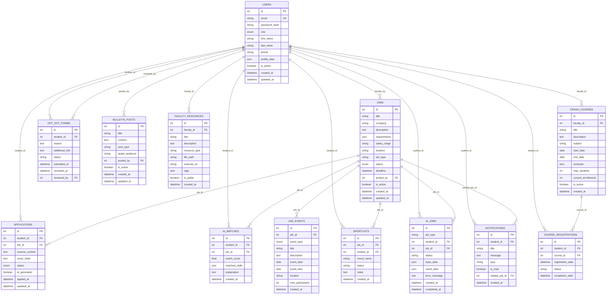
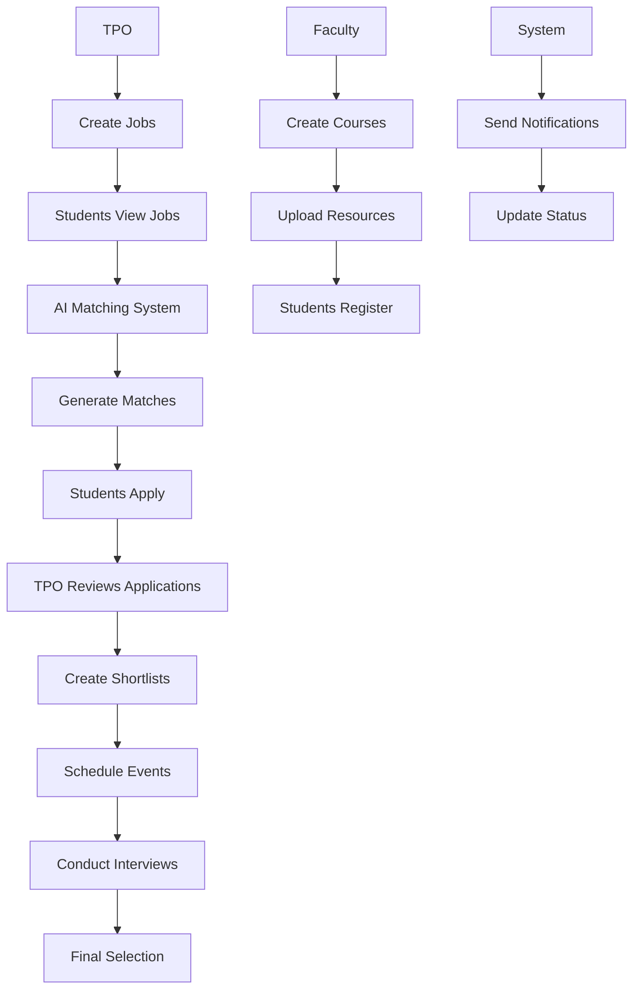

# Placement Navigator Database Schema Diagram

## Entity Relationship Diagram



## Key Relationships Summary

### 1. User Management
- **Users** are the central entity with different roles (student, tpo, faculty, employer)
- **Profile Data** stored as JSON for flexible student information storage
- **One-to-Many** relationships with all user-generated content

### 2. Job Management Flow
```
TPO creates JOBS → Students submit APPLICATIONS → AI generates MATCHES → TPO creates EVENTS → TPO creates SHORTLISTS
```

### 3. Student Features
- **Applications**: Students apply for jobs
- **Opt-out Forms**: Students can opt out of placement process
- **Course Registrations**: Students enroll in crash courses
- **Notifications**: Students receive system notifications

### 4. Faculty Features
- **Crash Courses**: Faculty create special courses
- **Faculty Resources**: Faculty upload educational materials
- **Course Management**: Track student enrollments

### 5. AI-Powered Features
- **AI Matches**: AI system matches students with jobs
- **AI Jobs**: Track AI agent executions
- **Smart Notifications**: Context-aware notifications

## Data Flow Diagram



## Sample Data Statistics

| Table | Records | Description |
|-------|---------|-------------|
| Users | 8 | 1 TPO, 2 Faculty, 5 Students |
| Jobs | 5 | Various internships and full-time positions |
| Applications | 8 | Multiple applications per student |
| AI Matches | 5 | High-quality matches (0.75-0.95 score) |
| Job Events | 3 | Tests and interviews scheduled |
| Shortlists | 3 | Interview round selections |
| Opt-out Forms | 1 | Student opting out for higher studies |
| Bulletin Posts | 3 | System announcements |
| Faculty Resources | 3 | Educational materials |
| Crash Courses | 2 | ML and Web Development courses |
| Course Registrations | 5 | Student enrollments |
| Notifications | 5 | User-specific alerts |

## Database Features by Role

### TPO Features
- ✅ User Management (upload student/faculty lists)
- ✅ Job Posting & Management
- ✅ Recruitment Process Tracking
- ✅ Event Scheduling
- ✅ Shortlist Management
- ✅ Announcements & Bulletins

### Student Features
- ✅ Authentication & Profile Management
- ✅ Job Discovery & Application
- ✅ AI-Powered Job Matching
- ✅ Event Participation
- ✅ Placement Opt-out
- ✅ Course Registration
- ✅ Notification System

### Faculty Features
- ✅ Resource Sharing
- ✅ Crash Course Management
- ✅ Student Enrollment Tracking
- ✅ Educational Content Management

This comprehensive database design supports all the required features while maintaining data integrity and providing a solid foundation for the Placement Navigator system.
